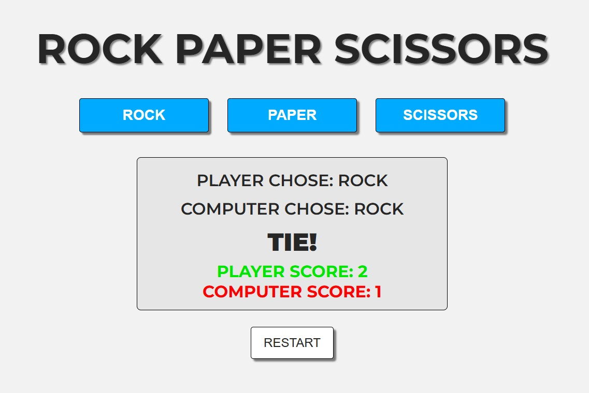

# Rock Paper Scissors Game

## Project Summary

The Rock Paper Scissors Game is an interactive web app where a player competes against the computer using modern front-end technologies. Built with HTML, CSS, and JavaScript, it demonstrates dynamic UI updates, event-driven logic, and real-time feedback in a clean, scalable layout.

This project reinforces essential front-end skills such as DOM manipulation, conditionals, event handling, and responsive design. It includes score tracking, a restart feature, and a user-friendly interface. Ideal for beginners, it also serves as a solid portfolio piece to showcase interactive UI development and best coding practices.

## Table of Contents

- [Mock Up](#mock-up)
- [Instructions](#instructions)
- [Key Features](#key-features)
- [Deployed Aplication](#deployed-application)

## Mock-Up

The following image shows the web application's appearance:

## Instructions

### 1. Launch the Application:

- Open `index.html` in any modern browser.

### 2. Play the Game:

- Click on any of the "ROCK", "PAPER", or "SCISSORS" buttons.

- The computer will randomly select its choice.

- The result and updated scores will display below.

### 3. Restart:

- Click the "RESTART" button to reset the scores and hide the display.

## Key Features

**Score Tracking:** Separate counters for both player and computer scores.

**Restart Capability:** Easy reset of game state to replay as many times as desired.

**Interactive UI:** DOM updates display player/computer choices and results clearly.

**Responsive and Scalable Design:** Clean layout works across multiple screen sizes and devices.

**Dynamic Game Logic:** Real-time feedback based on player input and randomized computer selection.

## Deployed Application

[Rock Paper Scissors Game](https://gilmerperez.github.io/rock-paper-scissors-game/)